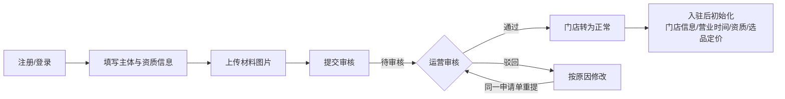
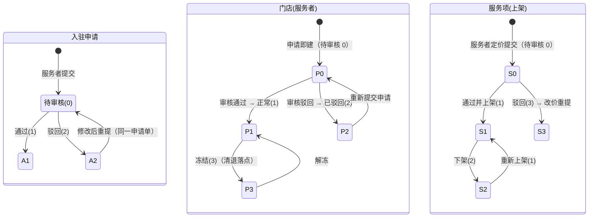

# 宠物 AI 健康管理平台 · 操作手册（交付版）

> **适用版本**：v0.1.0-SNAPSHOT · 快照 2026-10-01 · 提交 `021ba0a`
> **截图说明**：本手册全部截图为**真实系统实测**（演示数据见每处标注），按文件名存放在 `screenshots/` 目录。
> **术语约定**：平台侧统一使用「**服务者**」——「商家 / 商户 / 店铺」为禁用词，全平台文案与代码均不使用；其余术语以 `CONTEXT.md` 为准。

## 阅读路径（按角色选择）

| 读者 | 建议路径 |
| --- | --- |
| **服务者（商家侧）** | 第 1 章 → 第 2 章 → **第 4 章（入驻全流程）** → 第 3.1 / 3.4 节（后台功能） → 第 6.2 节（FAQ） |
| **运营管理员** | 第 1 章 → 第 2 章 → **第 5 章（审批全流程）** → 第 3.2 / 3.5 节（后台功能） → 第 6.3 节（FAQ） |
| 甲方/验收方 | 第 1 章 → 第 3 章（功能清单） → 第 4 / 5 章（两条主流程） → 第 7 章（截图索引与附录） |

---

# 1. 项目概述

## 1.1 平台是什么

以 AI 为基座、24 小时监护宠物健康的平台：**先让用户低成本自助解决问题，解决不了再匹配服务者完成交易**。三级问题解决生态：

```
① AI 自助            ② 远程人工              ③ 服务者服务
AI 健康管家（多模态     AI 解决不了的转人工      远程也解决不了的，匹配
分诊 + 风险分级）      咨询（到店付口径）        认证服务者到店/上门
        └─────────────── 解决不了则逐级下沉 ───────────────┘
```

三个端**全部是 Web**（ADR-0001）：C 端（宠物主人）、服务者后台、运营后台——同一套账号体系，**三个独立登录域**（登录状态互不通用，ADR-0012）。

## 1.2 三个端一览

| 端 | 使用者 | 本地地址（演示环境） | 登录 |
| --- | --- | --- | --- |
| C 端 | 宠物主人 | http://localhost:5173 | 手机号 + 密码；游客可浏览服务 |
| 服务者后台 | 服务者（门店） | http://localhost:5174 | 手机号 + 密码（任何启用账号可登，见 2.2） |
| 运营后台 | 平台运营 | http://localhost:5175 | 手机号 + 密码 + **准入名单**（见 2.2） |

> 演示账号：**13800138000 / pet12345**（三端通用；运营端需在名单内，演示环境已配置）。

## 1.3 快速上手

| 事项 | 在哪看 |
| --- | --- |
| 本地怎么跑（环境、命令、端口） | 仓库 `README.md`「本地怎么跑」；一键脚本 `./open.sh` |
| 目录结构与模块职责 | `README.md`「目录结构」、`ARCHITECTURE.md` |
| 领域术语 | `CONTEXT.md`（命名以此为准） |
| 架构决策（54 条） | `docs/adr/` |

---

# 2. 角色与权限说明

## 2.1 角色清单

| 角色 | 说明 | 入口 |
| --- | --- | --- |
| 游客 | 未登录用户：可浏览服务目录与门店列表 | C 端 |
| 注册用户 | 手机号注册（也可微信登录）：建档、打卡、AI 问答（每日免费额度）、下单、用券 | C 端 |
| 服务者账号 | 任何启用中的账号都可登录服务者后台（**权限后置**，ADR-0035）；入驻通过后成为该服务者的**管理员** | 服务者后台 |
| 运营 | 能进入运营后台的账号（**名单制**，fail-closed） | 运营后台 |
| 超级管理员 | 运营中的白名单子集：可**配置考核规则、覆盖单项分**（`ASSESSMENT_SUPER_ADMIN_USER_IDS`） | 运营后台 |
| 技师 | **角色体系尚未落地**（ADR-0035/0037「需要协调」）：当前技师动作用服务者账号在订单履约流程中完成（接宠检查/服务防护/取宠对比/报工） | 服务者后台-订单管理 |

## 2.2 各端准入规则（重要）

| 端 | 准入 | 不满足时的表现 |
| --- | --- | --- |
| C 端 | 无门槛；服务浏览对游客开放 | — |
| 服务者后台 | **不看名单**：任何启用中的账号都能登（入驻的第一步就是先能进来提交申请） | 账号被禁用时登录报 40300 |
| 运营后台 | **名单制、fail-closed**：账号 id 必须在 `CONSOLE_ADMIN_USER_IDS`（`server/.env`），**不配 = 谁都进不去** | 口令正确但不在名单 → 登录返回 **40300**（文案会提示「联系平台管理员开通」） |

> **运营把自己加进名单**：在 C 端注册一个账号 → 查它的 id → 写进 `server/.env` 的 `CONSOLE_ADMIN_USER_IDS` → 重启后端。详见 `README.md`「怎么把自己加进运营后台」。

## 2.3 权限边界与现状

- **越权防护**：所有资源访问都校验归属；**越权统一按「不存在」处理（40400）**，不泄露资源是否存在。
- **清退（冻结）**：按 ADR-0037 属超级管理员动作，但角色体系未落地——运营后台**不渲染**该入口并由页面写明原因（界面假装拦住不算拦住）。
- **数据范围**：运营后台可见全平台数据（所以名单制默认关闭开放）；服务者后台只可见自己的门店/订单/客户。

## 2.4 权限矩阵（贴近当前实现）

| 能力 | 游客 | 注册用户 | 服务者账号 | 运营 | 超级管理员 |
| --- | :-: | :-: | :-: | :-: | :-: |
| 浏览服务/门店 | ✓ | ✓ | ✓ | — | — |
| 建档/打卡/AI 问答 | — | ✓ | — | — | — |
| 下单/用券 | — | ✓ | — | — | — |
| 提交入驻申请 | — | — | ✓ | — | — |
| 门店经营（选品定价/核销/券承诺） | — | — | ✓（入驻通过后） | — | — |
| 入驻与资质审核 | — | — | — | ✓ | ✓ |
| 服务者状态处置（解冻） | — | — | — | ✓ | ✓ |
| 清退（冻结） | — | — | — | — | ✓（未渲染，见 2.3） |
| 标准目录/券池/内容审核/看板 | — | — | — | ✓ | ✓ |
| 考核规则与单项分覆盖 | — | — | — | — | ✓ |

---

# 3. 功能清单

## 3.1 服务者后台 · 11 个模块

| # | 模块 | 菜单入口 | 一句话 |
| --- | --- | --- | --- |
| 1 | 今日概览 | `/b/dashboard` | 当天订单/待接单/券额度/最近考核——5 分钟看完 |
| 2 | 订单管理 | `/b/orders` | 接单、派工、改状态、取消审批 |
| 3 | 核销管理 | `/b/redeem` | 扫码核销、核销记录与统计 |
| 4 | 券管理 | `/b/coupons` | 从券池挑服务者成本券并承诺额度、看核销 |
| 5 | 考核中心 | `/b/assess` | 拉新 40% + 券 40% + 过程 20% 的月度考核与等级 |
| 6 | 客户管理 | `/b/customers` | 到店客户列表与档案调取 |
| 7 | 数据看板 | `/b/stats` | 日/周/月经营数据 |
| 8 | 服务标准 | `/b/standard` | 标准目录勾选→区间内定价→提交上架审核；目录外提案 |
| 9 | 营销中心 | `/b/marketing` | 门店推广码（拉新归因入口） |
| 10 | 结算中心 | `/b/settle` | 到店付口径下的对账视图（平台不经手资金，ADR-0002） |
| 11 | 设置 | `/b/settings` | 入驻申请与进度、门店信息与营业时间、资质材料、团队 |

> 逐项演示（含截图、示例数据与预期结果）见 **3.4 节**。

## 3.2 运营后台 · 11 个模块

| # | 模块 | 菜单入口 | 一句话 |
| --- | --- | --- | --- |
| 1 | 服务者审核 | `/admin/providers` | 入驻与资质审核 / 服务者列表与状态 / 服务上架审核 / 联盟分类维度（4 个分段） |
| 2 | 标准目录管理 | `/admin/catalog` | 目录项与价格区间（服务者只能在区间内定价） |
| 3 | 券池管理 | `/admin/coupon-pool` | 券模板、服务者贡献额度、发放与核销 |
| 4 | 补贴券窗口 | `/admin/subsidy` | 平台补贴券的发放 |
| 5 | 用户管理 | `/admin/users` | 按 id 查用户：积分流水/权益判定/邀请关系 |
| 6 | 内容审核 | `/admin/content` | 社区内容机审后的人工复审 |
| 7 | 数据看板 | `/admin/stats` | 全平台数据（含订单与履约、AI 用量） |
| 8 | AI 运营 | `/admin/ai-ops` | 提示词/红线词/分级规则/护栏词/知识条目复核——AI 的业务可调项 |
| 9 | 积分与邀请配置 | `/admin/points-invite` | 积分规则、邀请阶梯与被邀请人奖励 |
| 10 | 考核规则配置 | `/admin/assess-rules` | 达标线、档位映射（含 AI 推荐优先级） |
| 11 | 系统配置 | `/admin/settings` | 平台级开关与配置 |

> 逐项演示见 **3.5 节**；审批相关三段（审核/状态/上架）见 **第 5 章**。

## 3.3 C 端 · 主要页面

首页驾驶舱 `/` · 服务页 `/services` · AI 管家 `/ai` · 健康档案 `/records` · 我的 `/profile` · 消息中心 · 我的订单 `/orders` · 我的券 `/coupons` · 积分中心 `/points` · 我的权益 · 邀请有礼 `/invites` · 社区 `/community` · 知识库 `/knowledge` · AI 帮我找服务 `/service-finder`

---

## 3.4 功能演示 · 服务者后台逐项

> 每条格式：**菜单入口** → **截图** → **示例数据** → **预期结果**。

### 3.4.1 登录 / 注册
- 入口：`http://localhost:5174/login`（「去注册」切到注册态）
- 截图：`screenshots/provider-00-login.png`
- 示例数据：手机号 `13900002222`、密码 `PetHealth123`、称呼（选填）
- 预期：登录/注册成功即进入「今日概览」；口令强度不满足或手机号已注册会就地报错（40001 / 该手机号已注册）

### 3.4.2 今日概览
- 入口：左栏「今日概览」
- 截图：`screenshots/provider-01-dashboard.png`
- 示例数据：演示门店「复验宠物医院」（已通过入驻）
- 预期：顶部显示当日订单/待接单/券/考核的实时摘要；**未入驻账号**这里显示引导（「当前账号还没有关联的服务者」+ 去设置提交申请）

### 3.4.3 订单管理
- 入口：左栏「订单管理」
- 截图：`screenshots/provider-02-orders.png`
- 示例数据：演示库暂无订单（空态）
- 预期：列表按状态分组（待接单/进行中/已完成/已取消），可接单、派工技师、取消审批

### 3.4.4 核销管理
- 入口：左栏「核销管理」
- 截图：`screenshots/provider-03-redeem.png`
- 示例数据：演示库暂无待核销券
- 预期：扫码/输码核销（**券与门店匹配校验；重复核销被拒**），核销记录可查

### 3.4.5 券管理
- 入口：左栏「券管理」
- 截图：`screenshots/provider-04-coupons.png`
- 示例数据：券池里有平台建的服务者成本券模板（演示库含 `CP-901`）
- 预期：可从券池承诺额度（承诺数=店里愿意接待的张数）；核销统计随核销联动

### 3.4.6 考核中心
- 入口：左栏「考核中心」
- 截图：`screenshots/provider-05-assess.png`
- 示例数据：考核截止由平台配置（演示库已配达标线：拉新 1 / 券 1.00）
- 预期：总分 = 拉新 40% + 券 40% + 过程 20%；等级决定 **AI 推荐优先级**（月度批算写回，C 端找店按它排序）

### 3.4.7 客户管理
- 入口：左栏「客户管理」
- 截图：`screenshots/provider-06-customers.png`
- 示例数据：演示库暂无到店客户
- 预期：客户列表、档案调取（服务过程中查看宠物档案）

### 3.4.8 数据看板
- 入口：左栏「数据看板」
- 截图：`screenshots/provider-07-stats.png`
- 示例数据：演示库数据量小，多数图为 0/低位
- 预期：日/周/月维度的单量、券核销、拉新

### 3.4.9 服务标准（选品定价）
- 入口：左栏「服务标准」（标准目录 / 我的服务项 / 目录外提案 三个分段）
- 截图：`screenshots/provider-08-standard.png`
- 示例数据：平台目录 44 项（6 大类）；演示门店已上架「猫三联疫苗 ¥84.00」
- 预期：勾选目录项 → 在**平台给出的价格区间内**填价（超出即时提示「价格须在 ¥X–¥Y 之间」，与后端 90001 文案逐字一致）→ 提交后进入「待审核」，运营通过即上架

### 3.4.10 营销中心（推广码）
- 入口：左栏「营销中心」
- 截图：`screenshots/provider-09-marketing.png`
- 示例数据：演示门店可生成/查看门店推广码
- 预期：用户扫码注册 → 关系归因到**门店**（拉新计入考核）；二维码图片与物料说明随页面给出

### 3.4.11 结算中心
- 入口：左栏「结算中心」
- 截图：`screenshots/provider-10-settle.png`
- 示例数据：到店付口径（平台不经手资金，ADR-0002）
- 预期：只做**对账视图**（券额度账 + 订单流水），没有提现/打款动作

### 3.4.12 设置（入驻申请 / 门店信息 / 资质 / 团队）
- 入口：左栏「设置」
- 截图：`screenshots/provider-11-settings.png`
- 示例数据：演示门店「已通过」状态下的三段（申请记录、门店信息与营业时间、资质材料）
- 预期：申请记录可回看每一步审核流水；门店信息与营业时间可维护（营业时间「不勾=当天休息」）；资质材料可补交/更新。**入驻全流程见第 4 章**

---

## 3.5 功能演示 · 运营后台逐项

### 3.5.1 登录（名单制）
- 入口：`http://localhost:5175/login`
- 截图：`screenshots/admin-00-login.png`
- 示例数据：`13800138000 / pet12345`（在 `CONSOLE_ADMIN_USER_IDS` 内）
- 预期：名单内成功进入「服务者审核」；**不在名单 → 40300**（排查见 6.3）

### 3.5.2 服务者审核（四分段总入口）
- 入口：左栏「服务者审核」
- 截图：`screenshots/admin-01-review-queue.png`（入驻与资质审核）、`admin-02-provider-list.png`（服务者列表与状态）、`admin-03-listing-review.png`（服务上架审核）、`admin-04-alliance.png`（联盟分类维度）
- 示例数据：演示库有 1 条已通过入驻（复验宠物医院）与 1 条待审核
- 预期：四段各司其职；**审批流程与状态流转详见第 5 章**

### 3.5.3 标准目录管理
- 入口：左栏「标准目录管理」
- 截图：`screenshots/admin-05-catalog.png`
- 示例数据：6 大类、44 个目录项（含价格区间）
- 预期：维护目录项与**价格区间**（服务者定价的上下界）；目录项停用后服务者端不可见

### 3.5.4 券池管理
- 入口：左栏「券池管理」
- 截图：`screenshots/admin-06-coupon-pool.png`
- 示例数据：演示库含服务者成本券模板与平台补贴券
- 预期：建券模板（面额/门槛/适用范围/成本承担方）、看服务者贡献额度与核销

### 3.5.5 补贴券窗口
- 入口：左栏「补贴券窗口」
- 截图：`screenshots/admin-07-subsidy.png`
- 示例数据：—（发放动作留痕）
- 预期：平台补贴券发放（成本归平台；服务者不能为补贴券承诺额度）

### 3.5.6 用户管理
- 入口：左栏「用户管理」
- 截图：`screenshots/admin-08-users.png`
- 示例数据：按用户 id 查询（演示：`1`）
- 预期：积分流水 / 权益判定 / 邀请关系三段；**契约没有按手机号搜索**，只能按 id 查（页面对此有提示）

### 3.5.7 内容审核
- 入口：左栏「内容审核」
- 截图：`screenshots/admin-09-content.png`
- 示例数据：演示库社区内容为空（空态）
- 预期：机审后的待复审列表；通过/驳回（驳回原因展示给作者）

### 3.5.8 数据看板
- 入口：左栏「数据看板」
- 截图：`screenshots/admin-10-stats.png`
- 示例数据：演示库数据量小
- 预期：全平台指标；订单与履约一格的金额口径是「**门店应收合计**」，不是平台流水（ADR-0002/0036 写明）

### 3.5.9 AI 运营
- 入口：左栏「AI 运营」
- 截图：`screenshots/admin-11-ai-ops.png`
- 示例数据：演示库提示词 p1、红线词表、40 条知识条目（含已复核示例）
- 预期：提示词/红线词/分级规则/护栏词/开关/知识条目复核/用量——业务可调项**改完即生效**（缓存 60 秒，ADR-0010）

### 3.5.10 积分与邀请配置
- 入口：左栏「积分与邀请配置」
- 截图：`screenshots/admin-12-points-invite.png`
- 示例数据：演示库含行为积分规则、邀请阶梯（1/3/5/10/15 档）、被邀请人奖励
- 预期：改配置立即生效；数值属「首批暂定值」，对外承诺前请与业务确认（E-07）

### 3.5.11 考核规则配置
- 入口：左栏「考核规则配置」
- 截图：`screenshots/admin-13-assess-rules.png`
- 示例数据：达标线（演示库拉新 1 / 券 1.00）、档位映射（含 recommend_priority）
- 预期：仅超级管理员（`ASSESSMENT_SUPER_ADMIN_USER_IDS`）可改；月度批算按此写回门店等级与推荐优先级

### 3.5.12 系统配置
- 入口：左栏「系统配置」
- 截图：`screenshots/admin-14-settings.png`
- 示例数据：—
- 预期：平台级开关与配置（改动的留痕与生效口径以页面说明为准）

---

## 3.6 功能演示 · C 端逐项

| # | 页面 | 入口 | 截图 | 示例数据 / 预期 |
| --- | --- | --- | --- | --- |
| 1 | 登录/注册 | `/login` | `c-00-login.png` | 手机号 + 密码（8–32 位，含字母与数字）；微信登录可用 |
| 2 | 首页驾驶舱 | 左栏「首页」 | `c-01-home.png` | 豆豆（柯基，3 岁）：健康评分、需要关注、今日任务、券提醒、邀请入口 |
| 3 | 服务页 | 左栏「服务」 | `c-02-services.png` | 六大分类、附近门店（区间价）、AI 帮我找服务入口 |
| 4 | AI 管家 | 左栏「AI 管家」 | `c-03-ai.png`、`c-13-ai-reply.png` | 真问一次（示例：呕吐 2 次）：🟡 建议尽快就医 + 可能原因（带知识库引用 [K-0022]/[K-0024]）+ 建议行动 + 免责声明 + 转人工入口；每日免费额度剩余数显示在页面上 |
| 5 | 健康档案 | 左栏「健康档案」 | `c-04-records.png` | 五维评分、分项档案、时间轴、导出/分享 |
| 6 | 我的 | 左栏「我的」 | `c-05-profile.png` | 订单与福利卡片、宠物、设置入口 |
| 7 | 我的订单 | 左栏「我的订单」 | `c-06-orders.png` | 订单列表（演示库空态） |
| 8 | 我的券 | 左栏「我的券」 | `c-07-coupons.png` | 演示券 `DEMO-GROOM-20`（¥20 洗护券，待使用） |
| 9 | 积分中心 | 左栏「积分中心」 | `c-08-points.png` | 积分余额与兑换档位 |
| 10 | 邀请有礼 | 左栏「邀请有礼」 | `c-09-invite.png` | 邀请海报/链接、阶梯进度（1/3/5/10/15） |
| 11 | 知识库 | 首页「知识库」 | `c-10-knowledge.png` | 类目浏览（疫苗/分诊/常见病） |
| 12 | 社区 | 首页「社区」 | `c-11-community.png` | 经验卡片与问答（录入即生成卡片，匿名） |
| 13 | AI 帮我找服务 | 服务页顶部入口 | `c-12-service-finder.png` | 描述症状 → 推荐服务项目（规则版，不调模型） |

---

# 4. 服务者入驻完整流程（服务者阅读路径）

## 4.0 流程总览



对应关系：**申请单**状态 `待审核(0) → 通过(1) / 驳回(2)`；**门店**状态 `待审核(0) → 正常(1)`（驳回为 2、冻结为 3）。

## 4.1 第一步：注册 / 登录

1. 打开服务者后台 → 登录页点「**去注册**」；
2. 填写：称呼（选填）/ 手机号 / 密码（8–32 位、含字母与数字）；
3. 点「注册并进入」——**注册即登录**，直接进入后台。

- 截图：`flow-01-register.png`（注册表单）、`flow-02-register-filled.png`（已填写）、`flow-03-dashboard.png`（注册后落地）
- 示例数据：手机号 `13900002222`
- 预期结果：进入「今日概览」。此时**还没有门店**，概览显示引导语：去「设置」提交入驻申请。
- 常见异常：
  - 手机号已注册 → 提示「该手机号已注册」，改登录；
  - 口令太弱 → 40001（按提示改强）。

## 4.2 第二步：填写主体与资质信息

入口：**设置 → 入驻申请与进度 → 提交入驻申请**。

截图：`flow-04-apply-empty.png`（空表单）。

| 字段 | 必填 | 规则（与后端一致） |
| --- | :-: | --- |
| 门店名称 | ✓ | ≤256 字 |
| 门店类型 | ✓ | 医院 / 洗护 / 训犬 / 寄养上门 / 食品用品 / 间接服务 六选一 |
| 联盟分类 | 只读 | **由平台在审核时归类**，服务者不能自选 |
| 联系人 | ✓ | ≤64 字（谁在对接平台审核） |
| 门店地址 | ✓ | ≤512 字（省市区 + 详细地址） |
| 联系电话 | ✓ | 手机号或带区号固话（如 `0571-88886666`）；**展示脱敏、原件加密存储** |
| 门店简介 | — | ≤1024 字 |
| 资质材料 | ✓ 至少 1 份 | 类型（营业执照/执业许可证/法人身份证/训犬师认证/健康证/其他）、名称、证件号（加密存、展示脱敏）、有效期起止（到期日不得早于生效日）、**每份必须上传材料图片** |

## 4.3 第三步：上传材料图片

1. 每份材料点「**选择图片**」→ 选图 → 自动上传；
2. 上传成功：出现缩略图，按钮变「换一张」，可「移除图片」；
3. 规格：**JPEG / PNG，单张 ≤ 10MB**；一份材料一张图（拍的证件要能看清）。

- 截图：`flow-05-apply-uploaded.png`（已上传、可提交的状态）
- 预期结果：本地校验不再提示缺图；缺哪一份会**点名报哪一份**（如「『营业执照』还没有上传材料图片」）。
- 上传失败排查：先确认**已登录且会话未过期**（本平台上传的第一道闸是身份鉴权），再重试；连续失败请附页面上的「请求 ID」反馈给平台。

## 4.4 第四步：提交审核

点「**提交审核**」后：

- 截图：`flow-06-submitted.png`
- 预期结果：出现「**申请已提交，等待平台审核**」；列表出现一条「待审核」，并提示「已有一份待审核的申请：审核期间不能修改材料」。
- **提交前系统会本地校验**（免得白跑一趟）：必填项、电话格式、材料日期、缺图点名。
- 后端可能拒绝的三种情形（都会给明确原因，40900）：
  1. 当前账号**已关联门店**；
  2. 已有**一份待审核**的申请（先用「修改后重新提交」改被驳回的那份）；
  3. 营业执照 / 身份证已被**另一个有效状态**的门店占用（被驳回或已冻结的记录不占名额）。

## 4.5 第五步：审核结果通知

- 查看位置：**设置 → 入驻申请与进度**（列表直接显示状态与**驳回原因**，点「查看详情」看门店全貌、材料、**审核流水**）。
- 现状说明：审核结果通过站内展示，**短信/推送通道尚未接入**——请主动回后台查看。
- 状态与含义：

| 状态 | 含义 | 下一步 |
| --- | --- | --- |
| 待审核 | 运营还没处理 | 等待；期间材料不可改 |
| 已通过 | 门店转为「正常」，你成为该门店管理员 | 进入 4.6 初始化配置 |
| 已驳回 | 附驳回原因（会原样展示） | 点「修改后重新提交」在**同一份申请单**上改完重提（重提次数会记录） |

## 4.6 第六步：入驻后初始化配置

| 事项 | 入口 | 说明 |
| --- | --- | --- |
| 门店信息与营业时间 | 设置 → 门店信息与营业时间 | **整体覆盖**保存；营业时间「不勾=当天休息」；跨天时段（如 22:00–02:00）本期不支持 |
| 资质材料维护 | 设置 → 资质材料 | 可补交/更新；**材料过期会被下架全部服务项**，补交后重新上架 |
| 团队（技师账号） | 设置 → 团队 | 角色体系未落地（见 2.1）：技师动作用本账号在订单履约里完成 |
| 选品定价 | 服务标准 → 标准目录 | 勾目录项 → 区间内定价 → 提交；运营通过即上架（截图 `flow-11-pricing-form.png`、`flow-12-listing-approved.png`） |
| 券承诺 | 券管理 | 从券池挑服务者成本券，承诺可核销额度 |
| 拉新入口 | 营销中心 | 生成门店推广码（扫码归因到门店，计入考核） |

- 截图：`flow-10-provider-approved.png`（通过后的设置页全貌）

## 4.7 异常场景与处理

| 场景 | 处理 |
| --- | --- |
| 被驳回 | 按驳回原因修改 → **同一申请单**重提（不新建门店记录；重提次数留痕） |
| 材料过期 | 平台下架全部服务项 → 补交新材料 → 重新定价提交上架 |
| 门店被冻结 | 运营侧「解冻」后恢复（被驳回状态不能直接解冻，需重走走审核） |
| 证件号被占用 | 换证件或联系平台核查（被驳回/冻结记录的占用名额会自动释放） |
| 重复提交 | 接口幂等（同一申请不会产生两条） |

---

# 5. 运营审批完整流程（运营阅读路径）

## 5.0 状态流转总览



## 5.1 登录与准入

- 入口：`http://localhost:5175/login`（截图 `admin-00-login.png`）。
- 准入：账号 id 必须在 `CONSOLE_ADMIN_USER_IDS`（**fail-closed**）。
- **40300 排查清单**：① 账号 id 是否写进名单且**重启过后端**（配置读启动值）；② 是否用了另一个登录域（C 端/服务者后台的登录状态在这里不通用）；③ 账号是否被禁用。

## 5.2 待办列表（入驻与资质审核）

- 入口：服务者审核 → **入驻与资质审核**（默认分段）。
- 截图：`flow-07-admin-queue.png`
- 示例数据：演示库有 1 条待审核（安心宠物医院）
- 预期结果：**先到先审**（按提交时间升序）；顶部可按状态筛选（待审核/已通过/已驳回/全部）；**驳回原因直接显示在列表列**里（服务者最关心「卡在哪」）。

## 5.3 审核详情与资质校验

点某一行「**审核**」打开详情：

- 截图：`flow-08-admin-detail.png`
- 详情内容：门店名称/类型/地址/联系人/联系电话（**脱敏**）/提交与重提次数；**资质材料表**（类型、名称、证件号脱敏、有效期、**材料图可点开原图**）；**审核流水**（提交 → 每次重提 → 通过/驳回的时间线）。
- 资质校验要点（人工核对项）：
  1. 材料图与所填类型/名称一致，证件在有效期内；
  2. 门店名称/地址与营业执照一致；
  3. 电话可回拨核实（页面按脱敏值展示）；
  4. 有疑问时先**驳回并写明原因**（原因会原样展示给服务者），不要用通过兜底。

## 5.4 通过

- 操作：详情底部「**审核通过**」，可填审核备注（选填）。
- 一键做三件事（按钮旁有代价说明）：**门店转正常、材料转通过、申请人绑定为该门店的管理员**。
- 截图：`flow-09-admin-approved.png`
- 预期结果：该申请状态变「已通过」，从待办队列消失；服务者侧（设置页）显示「入驻已通过：门店信息与资质在下面两段维护」。

## 5.5 驳回与退回修改

- 操作：详情底部「**驳回**」→ **驳回原因必填**（会原样展示给服务者，写清「差什么、怎么补」）。
- 服务者侧表现：列表与详情都能看到驳回原因；用「修改后重新提交」在**同一申请单**上重提（重提次数 +1，审核流水留痕）。
- 预期结果：重提后回到「待审核」，重新进入待办队列。

## 5.6 审批留痕与追溯

| 留痕 | 位置 | 内容 |
| --- | --- | --- |
| 审核流水 | 申请详情页 | 提交/重提/通过/驳回 全时间线（append-only） |
| 审核日志 | `provider_review_log` | 每次审核动作（含联盟分类、区域编码等处置） |
| 操作审计 | 平台审计日志 | 所有写操作带操作人与 trace_id（可依「请求 ID」追） |

## 5.7 审批完成后的状态流转

1. **门店转正常**：服务者「今日概览」不再报「未关联服务者」；可进入经营动作。
2. **服务者列表与状态**（截图 `admin-02-provider-list.png`）：搜索/筛选门店；详情里可做**状态处置（解冻）**、**联盟分类归类**（服务者不能自选，由运营在此维护）、**区域编码**（用于 C 端筛选；排他规则待业务定，E-01）。
3. **服务上架审核**（截图 `admin-03-listing-review.png`）：服务者提交的定价逐条过审——行内直接标「当前定价 vs 当前区间」，越界打红标（区间是**现取**的，不是提交时快照）；「**通过并上架**」或驳回（原因必填）。
4. **联盟分类维度**（截图 `admin-04-alliance.png`）：维护分类值域（新增档位无需发版）。

## 5.8 异常场景

| 场景 | 处理 |
| --- | --- |
| 服务者重复提交申请 | 系统已拦（40900 已有待审核）；如遇历史脏数据，联系技术按申请 id 处理 |
| 证件号被占用 | 提交侧被拦；如需人工裁定，核对被占用记录是否属同一主体（被驳回/冻结的会自动释放名额） |
| 上架价越界 | 系统红标提示；让服务者改价重提（不要通过） |
| 材料过期 | 平台会自动下架该店全部服务项，并提示补交；补交后由服务者重新定价上架 |
| 误通过/误驳回 | 通过不可逆（服务者已转正常）；如误操作，走状态处置（冻结）或让服务者重新提交相应材料——**操作前先看 5.3 的校验要点** |

---

# 6. 常见问题（FAQ）

## 6.1 C 端用户

**Q1：AI 说的能当诊断吗？**
不能。AI 输出**禁止**确诊、处方与用药剂量；每次回答都带免责声明，红色风险会直接给出「尽快就医/急诊」建议与附近 24 小时医院入口。紧急情况请直接就医。

**Q2：为什么 AI 回答里有的说法带引用编号（如 [K-0022]）？**
引用来自平台知识库；只有经兽医复核的条目会出现在引用里。若回答可能偏离，可用「转人工咨询」让平台人工再看一次。

**Q3：免费 AI 问答几次？**
每日有免费额度（演示配置 3 次/日，页面实时显示剩余次数）；用尽后可通过邀请/打卡等任务解锁或订阅。

**Q4：券为什么在某家店不能用？**
两类券规则不同：**服务者贡献的券只能在其本店核销**；**平台补贴券按适用范围**（页面会写明「核销门店：…」）。券的到店抵扣规则以券详情为准。

**Q5：删除的宠物还能找回吗？**
可以。删除是**软删除**：30 天内可恢复，到期才物理清理。

**Q6：下单了但不去了怎么退？**
订单支持取消；券会按规则回退（未核销的券不会消耗）。支付链路为「到店付」（平台不经手资金），不涉及线上退款流程。

## 6.2 服务者

**Q1：注册后为什么什么功能都用不了？**
服务者后台是「权限后置」：注册只能让你**先进来提交入驻申请**。入驻通过（状态变「正常」）后，选品定价、券承诺等功能才会解锁。

**Q2：审核期间为什么不能改材料？**
防止「审核员手里的材料」与「最终入库的材料」不是同一版。被驳回后可以改——用「修改后重新提交」在**同一份申请单**上重提。

**Q3：材料图片传不上去怎么办？**
先确认已登录且页面没有「会话过期」类提示（上传第一步要鉴权）；再检查图片格式（JPEG/PNG）与大小（≤10MB）。仍失败请把页面上的「请求 ID」发给平台。

**Q4：定价为什么只能在区间内？**
价格区间由平台在标准目录上定义（防止恶性低价/天价）。超出区间的会被后端拒绝（提示「价格须在 ¥X–¥Y 之间」），改到区间内再提交。

**Q5：我上架的服务怎么又没了？**
两种常见原因：① 资质材料**过期**——平台会下架全部服务项，补交材料后重新定价上架；② 你改过价——改价即回到「待审核」，通过前不在前台展示。

**Q6：怎么拉新最划算？**
营销中心生成**门店推广码**放在店里：用户扫码注册并完成建档、观察窗内产生有效行为后，归因计入门店（计入考核的拉新项）；考核等级会影响 AI 推荐优先级。

**Q7：结算怎么结？**
平台不经手资金（ADR-0002）：结算中心是**对账视图**（券额度账 + 订单流水），钱在门店直接收付。

## 6.3 运营

**Q1：账号密码都对，为什么登录还是 40300？**
运营后台是**名单制（fail-closed）**：把账号 id 加进 `CONSOLE_ADMIN_USER_IDS` 并**重启后端**；另外确认没有拿 C 端/服务者后台的登录状态来登运营端（三个登录域互不通用）。

**Q2：运营后台的注册为什么进不去？**
按设计：运营后台注册**只建账号、不自动授权**——能不能进由名单决定（页面的注册提示里写了这点）。

**Q3：审核通过前能改材料吗、通过后能改吗？**
待审核期间不能改（见 6.2-Q2）；通过后材料的维护转到「资质材料」段（可由服务者补交/更新，运营在审核页可再核）。

**Q4：通过按钮点下去会发生什么？**
一步做三件事：门店转正常、材料转通过、申请人成为该门店管理员——**不可逆**，按钮旁有代价说明。拿不准就先驳回（原因写清要补什么）。

**Q5：考核规则谁能改？**
超级管理员（`ASSESSMENT_SUPER_ADMIN_USER_IDS` 名单）——其他人看得到页面但动作会被拒（fail-closed）。达标线的种子值是 0（等于「平台还没定要求」），**对外承诺前请先配达标线**。

**Q6：用户管理怎么搜不到人？**
契约没有按手机号/昵称搜索的接口，只能按**用户 id** 查（页面对此有提示）。

---

# 7. 附录

## 7.1 截图索引（文件 / 菜单入口 / 示例数据 / 预期结果）

| 文件 | 菜单入口 | 示例数据 | 预期结果 |
| --- | --- | --- | --- |
| `screenshots/c-00-login.png` | C 端 登录/注册 | 13800138000 | 登录成功进入首页 |
| `screenshots/c-01-home.png` | C 端 首页 | 豆豆·柯基·3 岁 | 驾驶舱：评分/关注/任务/券 |
| `screenshots/c-02-services.png` | C 端 服务 | 六大分类 | 分类与门店列表（区间价） |
| `screenshots/c-03-ai.png` | C 端 AI 管家 | 问候卡 + 快捷标签 | 可发起咨询；额度与对象信息可见 |
| `screenshots/c-13-ai-reply.png` | C 端 AI 管家 | 「吐了两次」提问 | 🟡 分级 + 引用 + 免责声明 + 转人工 |
| `screenshots/c-04-records.png` | C 端 健康档案 | 打卡 1 天 | 五维评分与分项档案 |
| `screenshots/c-05-profile.png` | C 端 我的 | 演示账号 | 订单与福利卡片 |
| `screenshots/c-06-orders.png` | C 端 我的订单 | 空 | 空态引导 |
| `screenshots/c-07-coupons.png` | C 端 我的券 | DEMO-GROOM-20 | ¥20 洗护券·待使用 |
| `screenshots/c-08-points.png` | C 端 积分中心 | 演示积分 | 明细与兑换档位 |
| `screenshots/c-09-invite.png` | C 端 邀请有礼 | 0 人 | 海报/链接与阶梯 |
| `screenshots/c-10-knowledge.png` | C 端 知识库 | 类目种子 | 类目浏览 |
| `screenshots/c-11-community.png` | C 端 社区 | 空 | 卡片与问答入口 |
| `screenshots/c-12-service-finder.png` | C 端 AI 找服务 | 「皮肤问题」示例 | 推荐项目列表（规则版） |
| `screenshots/provider-00-login.png` | 服务者 登录/注册 | — | 两态互切 |
| `screenshots/provider-01-dashboard.png` | 服务者 今日概览 | 复验宠物医院（已通过） | 当日摘要；未入驻显示引导 |
| `screenshots/provider-02-orders.png` | 服务者 订单管理 | 空 | 状态分组列表 |
| `screenshots/provider-03-redeem.png` | 服务者 核销管理 | 空 | 核销入口与记录 |
| `screenshots/provider-04-coupons.png` | 服务者 券管理 | 券池模板 | 承诺额度与核销统计 |
| `screenshots/provider-05-assess.png` | 服务者 考核中心 | 达标线已配 | 总分/等级/流量影响 |
| `screenshots/provider-06-customers.png` | 服务者 客户管理 | 空 | 客户列表与档案调取 |
| `screenshots/provider-07-stats.png` | 服务者 数据看板 | 演示数据量小 | 日/周/月维度 |
| `screenshots/provider-08-standard.png` | 服务者 服务标准 | 44 项目录；已上架猫三联疫苗 | 选品定价（区间内） |
| `screenshots/provider-09-marketing.png` | 服务者 营销中心 | 门店推广码 | 二维码与物料说明 |
| `screenshots/provider-10-settle.png` | 服务者 结算中心 | 到店付口径 | 对账视图（非资金流水） |
| `screenshots/provider-11-settings.png` | 服务者 设置 | 已通过门店 | 申请记录/门店信息/资质/团队 |
| `screenshots/admin-00-login.png` | 运营 登录 | 名单内账号 | 进入服务者审核 |
| `screenshots/admin-01-review-queue.png` | 运营 服务者审核·入驻与资质审核 | 复验宠物医院已通过 | 先到先审队列 |
| `screenshots/admin-02-provider-list.png` | 运营 服务者审核·列表与状态 | 2 家门店 | 搜索/处置/归属 |
| `screenshots/admin-03-listing-review.png` | 运营 服务者审核·上架审核 | 猫三联疫苗 ¥84 | 越界红标；通过并上架 |
| `screenshots/admin-04-alliance.png` | 运营 服务者审核·联盟分类 | 分类维度 | 维护值域 |
| `screenshots/admin-05-catalog.png` | 运营 标准目录管理 | 6 类 44 项 | 目录与区间维护 |
| `screenshots/admin-06-coupon-pool.png` | 运营 券池管理 | 成本券/补贴券 | 模板与额度 |
| `screenshots/admin-07-subsidy.png` | 运营 补贴券窗口 | — | 补贴券发放 |
| `screenshots/admin-08-users.png` | 运营 用户管理 | 按 id 查 | 积分/权益/邀请三段 |
| `screenshots/admin-09-content.png` | 运营 内容审核 | 空 | 待复审列表 |
| `screenshots/admin-10-stats.png` | 运营 数据看板 | 演示数据量小 | 全平台指标（口径随页标注） |
| `screenshots/admin-11-ai-ops.png` | 运营 AI 运营 | 提示词/红线/知识条目 | 改完即生效（缓存 60s） |
| `screenshots/admin-12-points-invite.png` | 运营 积分与邀请配置 | 阶梯配置 | 立即生效（数值待业务确认） |
| `screenshots/admin-13-assess-rules.png` | 运营 考核规则配置 | 达标线/档位映射 | 仅超管可改 |
| `screenshots/admin-14-settings.png` | 运营 系统配置 | — | 平台级配置 |
| `screenshots/flow-01…12-*.png` | 入驻/审批全流程十二步 | 见第 4、5 章各处标注 | 见第 4、5 章各处标注 |

## 7.2 待补截图建议（演示数据不足或流程需真实订单）

| 建议截图 | 页面与画面内容 | 前置数据 |
| --- | --- | --- |
| 扫码核销成功 | 服务者 核销管理：核销结果与核销记录新增一行 | 一张已下单的券 + 对应门店 |
| 订单履约时间线 | 服务者 订单管理：接单→进行中→已完成的状态变化 | 一笔真实预约订单 |
| 三道照片墙 | 技师视角：接宠检查 / 服务防护 / 取宠对比（缺一道不能报工） | 进行中的订单 |
| 客户管理有数据 | 服务者 客户管理：到店客户列表 + 档案调取 | 至少 1 位到店客户 |
| 考核有分数 | 服务者 考核中心：非零总分与等级 | 完成一个考核周期的经营动作 |
| 红色风险 AI 样例 | C 端 AI 管家：🔴 立即急诊 +「附近 24 小时医院」按钮 | 触发红线词的问题（如「误食老鼠药」） |
| 内容审核有数据 | 运营 内容审核：一条待复审卡片 + 通过/驳回 | C 端发一条经验卡片 |
| 补贴券发放结果 | 运营 补贴券窗口：发放后券列表/核销状态 | 一次实际发放动作 |

## 7.3 术语表与相关文档

| 资料 | 位置 |
| --- | --- |
| 领域术语表（命名以此为准） | `CONTEXT.md` |
| 架构说明（模块边界、数据流、文件索引） | `ARCHITECTURE.md` |
| 架构决策记录（54 条） | `docs/adr/` |
| 验收状态（第五轮）+ 缺陷整改计划 | `docs/testing/` |
| 接口契约（OpenAPI） | `contract/` |
| 本地怎么跑 / 环境变量 / 一键脚本 | `README.md`、`open.sh` |
